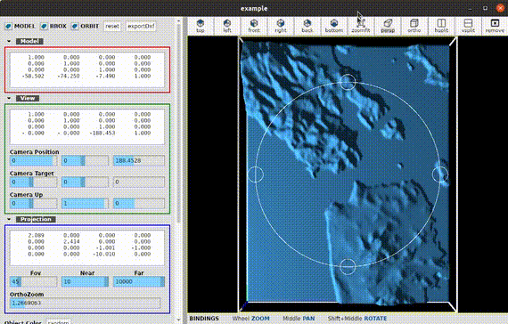
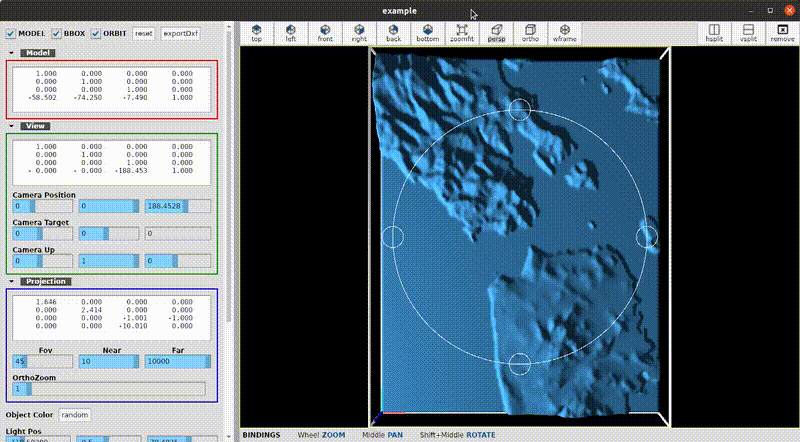
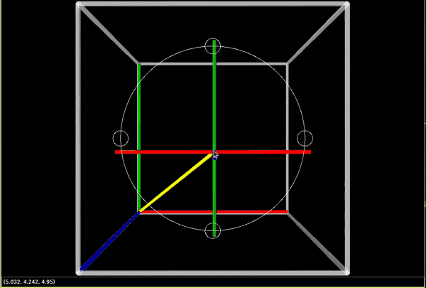
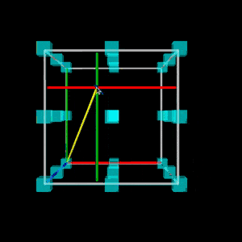
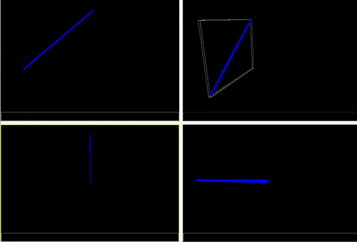

# netcore-opengl

[](https://www.nuget.org/packages/netcore-opengl/)

.NET core opengl

- [API Documentation](https://devel0.github.io/netcore-opengl/html/annotated.html)
- [Changelog](https://github.com/devel0/netcore-opengl/commits/master)

<hr/>

<!-- TOC -->
* [Roadmap](#roadmap)
* [Quickstart](#quickstart)
* [Keynotes](#keynotes)
* [Examples](#examples)
    - [0001](#0001)
    - [0002](#0002)
    - [0003](#0003)
    - [0004](#0004)
* [How this project was built](#how-this-project-was-built)
<!-- TOCEND -->

<hr/>

## Roadmap

- ray world to compute 3d wcs coord over mouse xy

## Quickstart

- prerequisite
```sh
apt install libglfw3
```

- [nuget package](https://www.nuget.org/packages/netcore-opengl/)

- [extension methods](https://devel0.github.io/netcore-opengl/html/class_search_a_thing_1_1_open_gl_ext.html)

```csharp
using SearchAThing;
```

- controls xaml

```
xmlns:opengl="clr-namespace:SearchAThing;assembly=netcore-opengl"
```

- [toolkit methods](https://devel0.github.io/netcore-opengl/html/class_search_a_thing_1_1_open_gl_toolkit.html)

```cs
using static SearchAThing.OpenGlToolkit;
```

- run examples

```sh
cd netcore-opengl
code .
```

hit F5 to start example ( change by edit [.vscode/launch.json](.vscode/launch.json) )

## build

```sh
mkdir ~/opensource
git clone https://github.com/devel0/netcore-util.git
git clone https://github.com/devel0/netcore-sci.git
git clone https://github.com/devel0/netcore-opengl.git

cd netcore-opengl
dotnet build
```

:point_right: To make dependency netcore-util debuggable comment `PackageReference` and uncomment `ProjectReference` for corresponding netcore-util/netcore-sci reference from [csproj](netcore-opengl/netcore-opengl.csproj)

## Keynotes

- create a derived class from [OpenGlModelBase](https://github.com/devel0/netcore-opengl/blob/ceaf31ceed2b60a438432cd59947d36971250c5c/examples/0001/SampleGlModel.cs#L9):
    - *OnInitialized* can be used to init VertexArray and VertexBuffer objects for static data; compile shaders; retrieve attrib and uniform locations; define attrib pointers
    - *Render* can be used to draw frame
- create a derived class from [OpenGlControl](https://github.com/devel0/netcore-opengl/blob/7219639f91567ff0a1ba8bb5a0559b3d01405c23/examples/0001/SampleGlControl.cs#L4) or use directly in xaml if not need to specialize
- glue [Model](https://github.com/devel0/netcore-opengl/blob/ceaf31ceed2b60a438432cd59947d36971250c5c/examples/0001/MainWindow.xaml.cs#L34) to the [control](https://github.com/devel0/netcore-opengl/blob/ceaf31ceed2b60a438432cd59947d36971250c5c/examples/0001/MainWindow.xaml#L28)
- [draw something](https://github.com/devel0/netcore-opengl/blob/0c8bbfa03c95070ce1bb24f7fed528966e1ae371/examples/0003/SampleGlModel.cs#L186-L275) using [vertex manager](https://github.com/devel0/netcore-opengl/blob/0fae8b7cebae277283e8d7e48ab2c9a02e5f517d/netcore-opengl/VertexManager/VertexManager.cs#L17) ; it will rendered as [coloured triangles](https://github.com/devel0/netcore-opengl/blob/0c8bbfa03c95070ce1bb24f7fed528966e1ae371/examples/0003/SampleGlModel.cs#L153)
- set Debug in [OpenGlModelOptions](https://github.com/devel0/netcore-opengl/blob/ceaf31ceed2b60a438432cd59947d36971250c5c/examples/0001/MainWindow.xaml.cs#L36) to get notified on console about GL error and [break debugger](https://github.com/devel0/netcore-opengl/blob/7219639f91567ff0a1ba8bb5a0559b3d01405c23/netcore-opengl/OpenGlModelBase.cs#L193) in DEBUG mode

## Examples

#### 0001

Triangle


#### 0002

STL map

- OrthoFit



- GridSplitManager



#### 0003

Show how to highlight mouse hovered 3d elements even in perspective mode





#### 0004

[Model animation](https://github.com/devel0/netcore-opengl/blob/6eb5cc6fc77f8bce337330d551be78aee17bd156/examples/0004/SampleGlModel.cs#L203)



## How this project was built

```sh
mkdir netcore-opengl
cd netcore-opengl

dotnet new sln
dotnet new classlib -n netcore-opengl

cd netcore-opengl
dotnet add package netcore-util --version 1.6.1
dotnet add package netcore-sci --version 1.8.0
dotnet add package Silk.NET --version 1.4.0
dotnet add package QuantumConcepts.Formats.STL.netcore --version 1.3.1
dotnet add package Avalonia --version 0.10.0-preview2
cd ..

dotnet sln add netcore-opengl
dotnet restore
dotnet build
```
