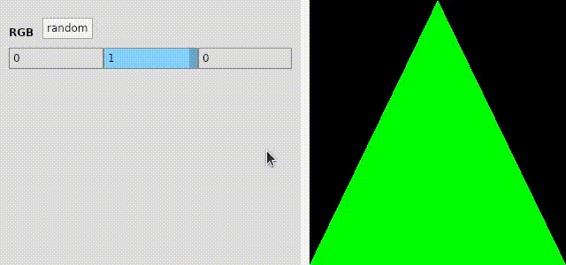

# netcore-opengl

[](https://www.nuget.org/packages/netcore-opengl/)

.NET core opengl

<hr/>

- [API Documentation](https://devel0.github.io/netcore-opengl/api/SearchAThing.html)
- [Recent changes](#recent-changes)
- [Quickstart](#quickstart)
- [Keynotes](#keynotes)
- [Examples](#examples)
- [How this project was built](#how-this-project-was-built)

<hr/>

## Recent changes

## Quickstart

- [nuget package](https://www.nuget.org/packages/netcore-opengl/)

- [extension methods](https://devel0.github.io/netcore-opengl/api/SearchAThing.OpenGlExt.html)

```csharp
using SearchAThing;
```

- controls xaml

```
xmlns:opengl="clr-namespace:SearchAThing;assembly=netcore-opengl"
```

- [toolkit](https://devel0.github.io/netcore-opengl/api/SearchAThing.OpenGlToolkit.html)

```cs
using static SearchAThing.OpenGlToolkit;
```

- run examples

```sh
cd netcore-opengl
code .
```

hit F5 to start example ( change by edit [.vscode/launch.json](.vscode/launch.json) )

## Keynotes

- create a derived class from [OpenGlModelBase](https://github.com/devel0/netcore-opengl/blob/ceaf31ceed2b60a438432cd59947d36971250c5c/examples/0001/SampleGlModel.cs#L9):
    - *OnInitialized* can be used to init VertexArray and VertexBuffer objects for static data; compile shaders; retrieve attrib and uniform locations; define attrib pointers
    - *Render* can be used to draw frame
- create a derived class from [OpenGlControl](https://github.com/devel0/netcore-opengl/blob/7219639f91567ff0a1ba8bb5a0559b3d01405c23/examples/0001/SampleGlControl.cs#L4) or use directly in xaml if not need to specialize
- glue [Model](https://github.com/devel0/netcore-opengl/blob/ceaf31ceed2b60a438432cd59947d36971250c5c/examples/0001/MainWindow.xaml.cs#L34) to the [control](https://github.com/devel0/netcore-opengl/blob/ceaf31ceed2b60a438432cd59947d36971250c5c/examples/0001/MainWindow.xaml#L28)
- set Debug in [OpenGlModelOptions](https://github.com/devel0/netcore-opengl/blob/ceaf31ceed2b60a438432cd59947d36971250c5c/examples/0001/MainWindow.xaml.cs#L36) to get notified on console about GL error and [break debugger](https://github.com/devel0/netcore-opengl/blob/7219639f91567ff0a1ba8bb5a0559b3d01405c23/netcore-opengl/OpenGlModelBase.cs#L193) in DEBUG mode

## Examples

#### 0001

Triangle



## How this project was built

```sh
mkdir netcore-opengl
cd netcore-opengl

dotnet new sln
dotnet new classlib -n netcore-opengl

cd netcore-opengl
dotnet add package netcore-util --version 1.6.1
dotnet add package netcore-sci --version 1.8.0
dotnet add package Silk.NET --version 1.4.0
dotnet add package QuantumConcepts.Formats.STL.netcore --version 1.3.1
dotnet add package Avalonia --version 0.10.0-preview2
cd ..

dotnet sln add netcore-opengl
dotnet restore
dotnet build
```
