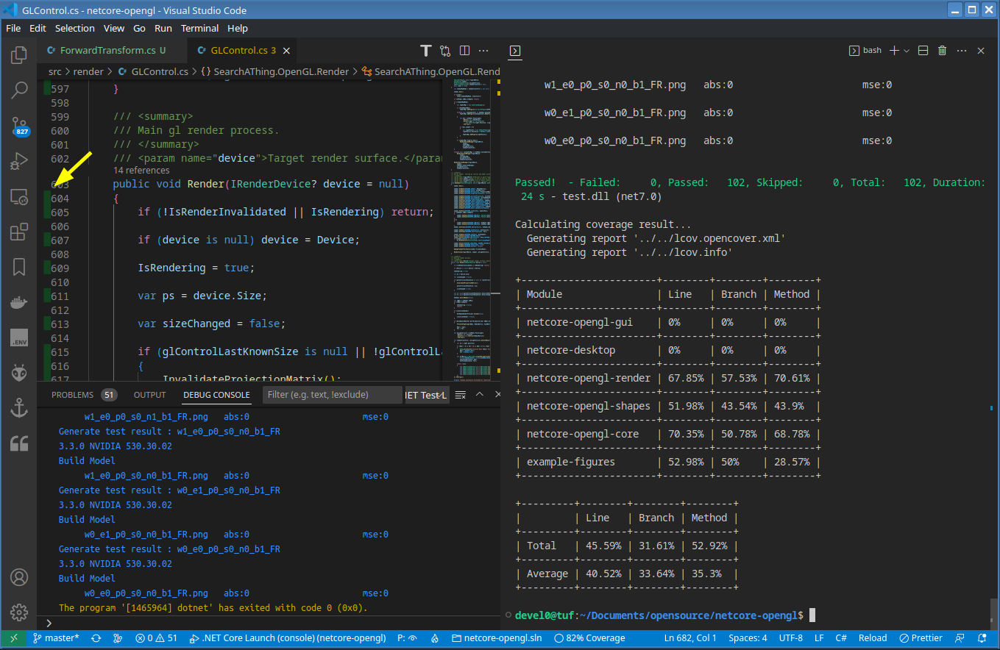

# netcore-opengl

[](https://www.nuget.org/packages/netcore-opengl/)

.NET core opengl

- [API Documentation][api]
- [Changelog][changelog]

[api]: https://devel0.github.io/netcore-opengl/html/annotated.html
[changelog]: https://github.com/devel0/netcore-opengl/commits/master

<hr/>

<!-- TOC -->

- [Introduction](#introduction)
- [Quickstart](#quickstart)
- [Examples](#examples)
  - [List of examples](#list-of-examples)
  - [Running examples from console](#running-examples-from-console)
  - [Running examples from vscode](#running-examples-from-vscode)
- [Development key notes](#development-key-notes)
  - [GL Dev inspect tool](#gl-dev-inspect-tool)
  - [Opengl debugging tools](#opengl-debugging-tools)
  - [Multiplatform](#multiplatform)
  - [Docker (mesa)](#docker-mesa)
  - [Software rendered (mesa)](#software-rendered-mesa)
  - [C# global usings (full)](#c%23-global-usings-full)
  - [Gestures mouse and keybindings](#gestures-mouse-and-keybindings)
- [Unit tests](#unit-tests)
- [How this project was built](#how-this-project-was-built)
  - [Documentation (github pages)](#documentation-github-pages)
    - [Build and view locally](#build-and-view-locally)
    - [Build and commit into docs branch](#build-and-commit-into-docs-branch)
- [References](#references)
<!-- TOCEND -->

<hr/>


## Introduction

**netcore-opengl** library provides a multiplatform framework for 3D rendering, visualization and interactions.

The library is composed by following modules:

| module   | framework        | dependencies                                           | description                     |
| -------- | ---------------- | ------------------------------------------------------ | ------------------------------- |
| [core]   | NET Standard 2.1 | [netcore-ext], [System.Drawing.Common]                 | math for opengl                 |
| [render] | NET 7            | [core], [Silk.NET], [Magick.NET], [SkiaSharp.HarfBuzz] | opengl pipeline rendering, text |
| [gui]    | NET 7            | [render], [Avalonia], [netcore-desktop]                | desktop gl widget               |
| [shapes] | NET 7            | [core]                                                 | box, cone, sphere, arrow shapes |

[core]: https://www.nuget.org/packages/netcore-opengl-core
[render]: https://www.nuget.org/packages/netcore-opengl-render
[gui]: https://www.nuget.org/packages/netcore-opengl-gui
[shapes]: https://www.nuget.org/packages/netcore-opengl-shapes
[netcore-ext]: https://www.nuget.org/packages/netcore-ext
[system.drawing.common]: https://www.nuget.org/packages/System.Drawing.Common
[silk.net]: https://www.nuget.org/packages/Silk.NET
[magick.net]: https://www.nuget.org/packages/Magick.NET-Q8-AnyCPU
[skiasharp.harfbuzz]: https://www.nuget.org/packages/SkiaSharp.HarfBuzz
[avalonia]: https://www.nuget.org/packages/Avalonia
[netcore-desktop]: https://www.nuget.org/packages/netcore-desktop

## Quickstart

```sh
dotnet new console --use-program-main -n sample
cd sample
dotnet add package netcore-opengl-gui
dotnet add package netcore-opengl-shapes
code .
# accept to install vscode required assets
```

edit [`Program.cs`](examples/example-9000/Program.cs) as follows ( consider to create a separate global [usings.cs](#c%23-global-usings-full) file ):

```csharp
namespace sample;

// quickstart

using Vector3 = System.Numerics.Vector3;
using Color = System.Drawing.Color;
using SearchAThing.OpenGL.Core;
using static SearchAThing.OpenGL.Core.Constants;
using SearchAThing.OpenGL.Render;
using SearchAThing.OpenGL.GUI;
using static SearchAThing.OpenGL.GUI.Toolkit;
using SearchAThing.OpenGL.Shapes;

class Program
{
    static void Main(string[] args)
    {
        // this must called for console application to enable Avalonia framework
        // and must called before any other Avalonia control usage
        InitAvalonia();

        // create standalone Avalonia window for Silk.NET opengl rendering
        var w = GLWindow.Create();

        // define the GLModel build function
        w.GLModel.BuildModel = (glCtl, isInitial) =>
        {
            if (!isInitial) return;

            var glModel = glCtl.GLModel;

            // clear the model
            glModel.Clear();

            // place a point light at xyz=(2,2,2)
            glModel.PointLights.Add(new GLPointLight(2, 2, 2));

            // create and add a sphere centered at (0,0,0) with radius=1 and meshed as uvsphere with N=20 divisions
            var sphere = new UVSphere(center: Vector3.Zero, radius: 1);
            glModel.AddFigure(sphere.Figure(divisions: 20).SetColor(Color.Cyan));

            // place a base box which receive sphere shadow centered like the sphere but 2*z lower ( out of sphere )
            // with size xyz=(5, 5, .1f) larger than sphere but with small thickness
            var basebox = new Box(cs: WCS.Move(sphere.Center - Vector3.UnitZ * 2), csSize: new Vector3(5, 5, .1f));
            glModel.AddFigure(basebox.Sides);

            glCtl.CameraView(CameraViewType.Right);
        };

        // show the gl window
        w.ShowSync();
    }
}
```

```sh
dotnet run # or hit F5 from vscode
```

results ( control can manipulated with [gestures](#gestures-mouse-and-keybindings) ):

[![img][sample]][sample]

[sample]: data/images/sample.png

## Examples

Click on the `example code` link to open source code of the example, read top tour instructions contained in each example to test functions, for example following in the top comment of example 0000:

```cs
// example-0000
// draw a triangle with 3 colors (one for each vertex)
//
// use gesture such as:
// - 'w' to toggle wireframe
// - ctrl right/left to change tilt
// - mouse wheel to zoom
// - 'z' to zoomfit
// - ctrl + x to show bbox
```

### List of examples

| example code        | image              | description                                                                                                                                                   |
| ------------------- | ------------------ | ------------------------------------------------------------------------------------------------------------------------------------------------------------- |
| [0000][es0]         | [![img][e0]][e0]   | Draw a triangle with 3 colors (one for each vertex).                                                                                                          |
| [0001][es1]         | [![img][e1]][e1]   | Random lines ( console program ).                                                                                                                             |
| [0002][es2] (mvvm)  | [![img][e2]][e2]   | Random lines ( avalonia AXAML program ).                                                                                                                      |
| [0003][es3]         | [![img][e3]][e3]   | Render stl terrain map varying vertex colors by height ; presence of a point light makes shadows.                                                             |
| [0004][es4]         | [![img][e4]][e4]   | Draw text.                                                                                                                                                    |
| [0005][es5]         | [![img][e5]][e5]   | Draw box with keyboard face toggler.                                                                                                                          |
| [0006][es6]         | [![img][e6]][e6]   | Draw nurb surface with triangles normal and animation, layout loaded from saved file.                                                                         |
| [0007][es7]         | [![img][e7]][e7]   | Draw nurb tube with triangle selection on click through raycast in perspective mode; generate gl split layout programmtically generated.            |
| [0008][es8] (mvvm)  | [![img][e8]][e8]   | Draw nurb tube with lighting tunable from mvvm interface.                                                                                           |
| [0009][es9]         | offscreen render   | Generate two capture of different sizes from the same scene.                                                                                                  |
| [0010][es10]        | [![img][e10]][e10] | Draw 3d shapes on a textured cube face.                                                                                                                       |
| [0011][es11]        | [![img][e11]][e11] | Texture, light and text transparency.                                                                                                                         |
| [0012][es12]        | [![img][e12]][e12] | Show text alignment types with their bounding box.                                                                                                            |
| [0013][es13]        | [![img][e13]][e13] | Multiline text.                                                                                                                                               |
| [0014][es14]        | [![img][e14]][e14] | Scalability benchmark for text.                                                                                                                               |
| [0015][es15]        | [![img][e15]][e15] | Raycast in orthogonal mode for snapping test.                                                                                                                 |
| [0016][es16] (mvvm) | [![img][e16]][e16] | Invalidate control on vertex change.                                                                                                                          |
| [0017][es17]        | [![img][e17]][e17] | Figure using screen coord.                                                                                                                                    |
| [0018][es18]        | [![img][e18]][e18] | Illusion of rotating base box model while its the camera rotating around.animation, rotates small box using object matrix in all scene ; show camera frustum. |
| [0019][es19] (mvvm) | [![img][e19]][e19] | Sphere vertex render and hittest scalability test.                                                                                                            |
| [0020][es20]        | customize gesture  | Customize key gesture.                                                                                                                                        |

[es0]: examples/example-0000/Program.cs
[es1]: examples/example-0001/Program.cs
[es2]: examples/example-0002/Views/MainWindow.axaml.cs
[es3]: examples/example-0003/Program.cs
[es4]: examples/example-0004/Program.cs
[es5]: examples/example-0005/Program.cs
[es6]: examples/example-0006/Program.cs
[es7]: examples/example-0007/Program.cs
[es8]: examples/example-0008/Views/MainWindow.axaml.cs
[es9]: examples/example-0009/Program.cs
[es10]: examples/example-0010/Program.cs
[es11]: examples/example-0011/Program.cs
[es12]: examples/example-0012/Program.cs
[es13]: examples/example-0013/Program.cs
[es14]: examples/example-0014/Program.cs
[es15]: examples/example-0015/Program.cs
[es16]: examples/example-0016/Views/MainWindow.axaml.cs
[es17]: examples/example-0017/Program.cs
[es18]: examples/example-0018/Program.cs
[es19]: examples/example-0019/Views/MainWindow.axaml.cs
[es20]: examples/example-0020/Program.cs
[e0]: data/images/examples/0000.png
[e1]: data/images/examples/0001.png
[e2]: data/images/examples/0002.png
[e3]: data/images/examples/0003.png
[e4]: data/images/examples/0004.png
[e5]: data/images/examples/0005.png
[e6]: data/images/examples/0006.png
[e7]: data/images/examples/0007.png
[e8]: data/images/examples/0008.png
[e9]: data/images/examples/0009.png
[e10]: data/images/examples/0010.png
[e11]: data/images/examples/0011.png
[e12]: data/images/examples/0012.png
[e13]: data/images/examples/0013.png
[e14]: data/images/examples/0014.png
[e15]: data/images/examples/0015.png
[e16]: data/images/examples/0016.png
[e17]: data/images/examples/0017.png
[e18]: data/images/examples/0018.png
[e19]: data/images/examples/0019.png

### Running examples from console

```sh
cd netcore-opengl
dotnet run --project examples/example-0000
```

### Running examples from vscode

```sh
cd netcore-opengl
code .
```

C-S-p -> `NET: Generate Assets for Build and Debug`

choose an example.

Tip: to change startup example from bash `./set-startup-example xxxx` where xxxx on of provided examples.

This will update `.vscode/launch.json` then hit F5 to start.

## Development key notes

Most of technical documentation is directly integrated with [API documentation](https://devel0.github.io/netcore-opengl/html/annotated.html).

### GL Dev inspect tool

Hit `F1` gesture to open gl dev tool useful to understand how conversion translates between spaces; it provides some basic support such as:

- show render count
- show/edit GlView title
- toggle control perspective, shadow, texture, wireframe, shadewithedge
- override light ambient, diffuse, specular strength
- change fovdeg, show camera coordinates and frustum
- toggle autoadjust near/far with near,far edit
- show bbox size and model/view/projection matrixes
- activate, deactivate light and raw light position edit


### Opengl debugging tools

To implement some technical part of this library the [RenderDoc](https://renderdoc.org/) tool was a useful to investigate the content of the gl pipeline and to see the cube depth map generated to handle point light shadow rendering.

### Multiplatform

- The same binary compiled in a platform can run in others.
- For example compile the solution then try to copy an example `bin` folder to other machine, then issue `dotnet bin/Debug/net7.0/example-xxxx.dll`.

### Docker (mesa)

Unit tests of this projects can run in docker ( see [this folder](src/test/docker) ).

For a simple program execution there is an example in the offscreen rendering [example-0009](examples/example-0009/docker-example/), to execute it:

```sh
cd examples/example-0009/docker-example
./build.sh
./run.sh
```

that executes with follow output:

```
GL VERSION = 4.5 (Core Profile) Mesa 22.2.5
finished
Generated file:
total 52K
drwxr-xr-x 2 devel0 devel0 4.0K Mar 29 13:46 .
drwxrwxr-x 3 devel0 devel0 4.0K Mar 29 13:06 ..
-rw-r--r-- 1 devel0 devel0  21K Apr  3 10:33 example-0009-1024x768.png
-rw-r--r-- 1 devel0 devel0  18K Apr  3 10:33 example-0009-640x480.png
```

generated files can be found in the `examples/example-0009/docker-example/output` generated folder.

### Software rendered (mesa)

For example if you try to run the binary or sources from Windows guest in VirtualBox linux host you can receive follow error:

```
C:\Users\devel0\Downloads\bin\Debug\net7.0>dotnet example-0010.dll
Unhandled exception. System.AggregateException: One or more errors occurred. (ApiUnavailable: WGL: The driver does not appear to support OpenGL)
 ---> Silk.NET.GLFW.GlfwException: ApiUnavailable: WGL: The driver does not appear to support OpenGL
   at Silk.NET.GLFW.Glfw.<>c.<.cctor>b__141_0(ErrorCode errorCode, String description)
   at Silk.NET.GLFW.Glfw.CreateWindow(Int32 width, Int32 height, String title, Monitor* monitor, WindowHandle* share)
   at Silk.NET.Windowing.Glfw.GlfwWindow.CoreInitialize(WindowOptions opts)
   at Silk.NET.Windowing.Internals.WindowImplementationBase.CoreInitialize(ViewOptions opts)
   at Silk.NET.Windowing.Internals.ViewImplementationBase.Initialize()
   at SearchAThing.OpenGL.Render.GLContext..ctor() in /home/devel0/Documents/opensource/netcore-opengl/src/render/GLContext.cs:line 183
```

To overcome the issue you can execute with software rendered mesa graphics driver.

To install:

- Download [mesa library](https://fdossena.com/?p=mesa/index.frag).
- Unpack `MesaForWindows-x64-20.1.8.7z` in a folder.
- Set the environment variable `OPENGL_LIBRARY_PATH` to the path of the folder containing `opengl32.dll`.


_Technical note:_

Mesa 20.1.8.7 doesn't expose glsl support for 4.6 regardless of that it contains effective implementation for that. To fix the problem `netcore-opengl` automatically set [two other environment variables](https://github.com/devel0/netcore-opengl/blob/37ad075f4bd983e9bfbeaa86d606fc25f3430eb5/src/render/GLContext.cs#L158-L159) when mesa is used.

### C# global usings (full)

Following is the list of global usings for app using gui and shapes modules.
Just create a global.cs file and put into your solution to avoid `using` on each single .cs file.

```cs
// core ( deps )
global using System;
global using System.Linq;
global using System.Globalization;
global using System.Collections;
global using System.Collections.Generic;
global using System.Collections.ObjectModel;
global using System.Text;
global using System.Text.RegularExpressions;
global using System.IO;
global using System.Diagnostics;
global using System.Threading.Tasks;
global using System.Numerics;
global using System.ComponentModel;
global using System.Runtime.CompilerServices;
global using static System.Math;
global using static System.FormattableString;
global using Vector3 = System.Numerics.Vector3;
global using Color = System.Drawing.Color;
global using Size = System.Drawing.Size;
global using ColorTranslator = System.Drawing.ColorTranslator;
global using System.Reflection;
global using SearchAThing.Ext;
global using static SearchAThing.Ext.Toolkit;

// render ( deps )
global using SkiaSharp;
global using Silk.NET.OpenGL;
global using System.Threading;

// gui ( deps )
global using SearchAThing.Desktop;
global using Avalonia;
global using Avalonia.Input;
global using Point = Avalonia.Point;
global using Avalonia.Media;
global using AColor = Avalonia.Media.Color;
global using ABrush = Avalonia.Media.Brush;
global using Avalonia.Data.Converters;

// core
global using SearchAThing.OpenGL.Core;
global using static SearchAThing.OpenGL.Core.Toolkit;
global using static SearchAThing.OpenGL.Core.Constants;

// render
global using SearchAThing.OpenGL.Render;
global using static SearchAThing.OpenGL.Render.Constants;
global using static SearchAThing.OpenGL.Render.Toolkit;

// gui
global using SearchAThing.OpenGL.GUI;
global using static SearchAThing.OpenGL.GUI.Toolkit;
global using static SearchAThing.OpenGL.GUI.Constants;

// shapes
global using SearchAThing.OpenGL.Shapes;
global using static SearchAThing.OpenGL.Shapes.Toolkit;
```

### Gestures mouse and keybindings

Gesture can be overriden ( see [example-0020](https://github.com/devel0/netcore-opengl/blob/3943766b7cb98ae46149fbf14e54497f84ecf41f/examples/example-0020/Program.cs#L19-L23) ).

| Key       | Description                    |
| --------- | ------------------------------ |
| F1        | Open dev tool                  |
| F2        | Save current view              |
| F3        | Restore last saved view        |
| Ctrl + F2 | Save current view layout       |
| Ctrl + F3 | Restore last saved view layout |
| a         | Toggle ObjectMatrix animate    |
| o         | View bOttom                    |
| t         | View Top                       |
| l         | View Left                      |
| r         | View Right                     |
| f         | View Front                     |
| b         | View Back                      |
| Ctrl + ⬆  | Camera zoom in                 |
| Ctrl + ⬇  | Camera zoom out                |
| Shift + ⬅ | Camera pan left                |
| Shift + ➡ | Camera pan right               |
| Shift + ⬆ | Camera pan up                  |
| Shift + ⬇ | Camera pan up                  |
| ⬅         | Model rotate left              |
| ➡         | Model rotate right             |
| ⬆         | Model rotate up                |
| ⬇         | Model rotate down              |
| Ctrl + ⬅  | Camera tilt left               |
| Ctrl + ➡  | Camera tilt right              |
| Alt + ⬅   | Camera rotate left             |
| Alt + ➡   | Camera rotate right            |
| Alt + ⬆   | Camera rotate up               |
| Alt + ⬇   | Camera rotate down             |
| h         | Split view horizontal          |
| v         | Split view vertical            |
| c         | Close current view             |
| w         | Toggle wireframe               |
| Ctrl + w  | Toggle shade with edges        |
| n         | Toggle show normals            |
| p         | Toggle perspective             |
| x         | Toggle texture                 |
| s         | Toggle shadow                  |
| z         | Zoom fit                       |
| i         | Invalidate view                |
| Ctrl + x  | Toggle model bbox              |
| Ctrl + c  | Toggle camera object           |

## Unit tests

- debugging unit tests
  - from vscode click `debug test` on codelens button
- executing all tests
  - from solution root folder `dotnet test`
- testing coverage
  - from vscode run task ( ctrl+shift+p ) `Tasks: Run Task` then `test with coverage` or use provided script `./generate-coverage.sh`
  - extensions required to watch coverage ( `Coverage Gutters` )



## How this project was built

```sh
mkdir netcore-opengl
cd netcore-opengl

mkdir src examples

cd src
dotnet new classlib -n netcore-opengl-core
mv netcore-opengl-core core
cd ..

cd examples
dotnet new console --use-program-main -n example
mv example/example.csproj example/example-0001.csproj
mv example example-0001

dotnet new --install Avalonia.Templates
dotnet new avalonia.mvvm -n example
mv example/example.csproj example/example-0002.csproj
mv example example-0002

dotnet new classlib -n example-figures

dotnet new xunit -n test
cd test
dotnet add reference ../ext/netcore-ext.csproj
# enable test coverage collector
# to view in vscode ( "Coverage Gutters" ext ) run `./test-coverage` then `C-S-p` Coverage Gutters: Watch
dotnet add package coverlet.collector
dotnet add package coverlet.msbuild
cd ..

cd ..

dotnet new sln
dotnet sln add src/core src/test
dotnet sln add examples/example-0001 examples/example-0002 examples/example-figures
dotnet build
```

### Documentation (github pages)

Configured through Settings/Pages on Branch docs ( path /docs ).

- while master branch exclude "docs" with .gitignore the docs branch doesn't

#### Build and view locally

```sh
./doc build
./doc serve
./doc view
```

#### Build and commit into docs branch

```sh
./doc commit
```

## References

- [OpenGL Transformation](http://www.songho.ca/opengl/gl_transform.html) 
- [The Perspective and Orthographic Projection Matrix](https://www.scratchapixel.com/lessons/3d-basic-rendering/perspective-and-orthographic-projection-matrix/projection-matrix-GPU-rendering-pipeline-clipping.html)
